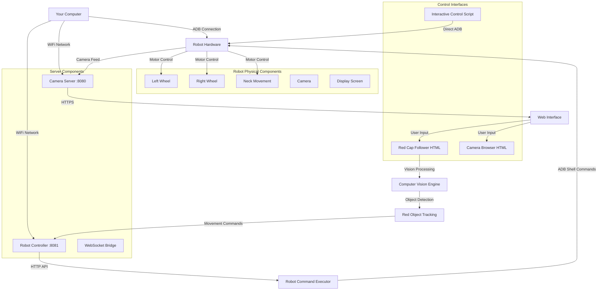

# 🤖 Mizo OS - Your Personal AI Assistant Robot

Hey there! to who ever is readign this and s intrested in building upon this project, I wish you the best. I'm Azhan, and this is **Mizo OS**  my attempt at creating the ultimate personal assistant robot that can follow you around and be genuinely useful such as send emails or make task lists all while jsut beign a robot around you using AI and vision technology.

## 🎯 The Big Picture

The whole idea behind Mizo OS is simple: I want a robot that works as a **personal assistant** using MCP (Model Context Protocol) to move around and be your own AI companion. Think of it as having your own R2-D2 that can follow you around, understand what you need, and actually help you out using cutting-edge AI and vision tech and keeps learning as it goes aroudn the person.

This isn't just another tech demo, I was wanting to  build something that could genuinely change how we interact with AI assistants by making them physical, mobile, and contextually aware of their environment. 

## 🚀 What's Inside

This repo contains two main ways to control your robot:

### 1. 🎮 Interactive Manual Control (`interactive_control.sh`)
Direct, real-time keyboard control of your robot - perfect for testing, manual navigation, or just having fun.

### 2. 🔴 Red Cap Follower (`start_red_cap_follower.sh`) 
An AI-powered vision system that tracks red objects (like a red cap) and makes the robot follow you around autonomously. This is the semi-developed autonomous following system I'm working on.

## 🛠️ Setup & Requirements

### What You Need:
- An Ohmni robot (or compatible robot with similar control interface)
- Your device (computer/laptop) and the robot on the **same WiFi network**
- ADB (Android Debug Bridge) installed on your computer
- A red cap/hat for the follower system (this is just cuz I had a cap on me that day)

### Getting Connected:

1. **Enable Developer Mode on Robot:**
   - Go to robot settings
   - Click on the version number text **7 times** (its an andriod tablet OS)
   - Developer mode will open up
   - Note down the robot's IP address

2. **Connect via ADB:**
   ```bash
   adb connect [ROBOT_IP_HERE]
   ```
   Replace `[ROBOT_IP_HERE]` with your robot's actual IP address.

3. **Verify Connection:**
   ```bash
   adb devices
   ```
   You should see your robot listed.

## 🎮 Interactive Control Mode

Want to drive the robot around manually? This is your go-to:

```bash
./interactive_control.sh
```

### Controls:
- **w** - Move Forward
- **s** - Move Backward  
- **a** - Turn Left
- **d** - Turn Right
- **q** - STOP (Emergency - keep this handy!)
- **u** - Neck Up
- **j** - Neck Down
- **c** - Center Neck
- **l** - LED On
- **o** - LED Off
- **+** - Increase Power
- **-** - Decrease Power
- **p** - Show Power Settings
- **x** - Exit

**Safety First:** Always keep your finger near 'q' to stop the robot immediately if needed!

## 🔴 Red Cap Follower (Autonomous Mode)

This is where the magic happens  AI-powered autonomous following:

```bash
cd /Users/azhan/Pictures/Mizo_Main && chmod +x start_red_cap_follower.sh && ./start_red_cap_follower.sh
```

### What This Does:
1. Starts a camera server for video processing
2. Launches the robot controller 
3. Opens the red cap follower interface on the robot's screen
4. Uses computer vision to detect red objects
5. Calculates distance and position
6. Commands the robot to follow you around

### How to Use:
1. Put on a red cap or hold a red object
2. The system will open automatically on the robot's screen
3. Click "Start Camera" 
4. Click "Start Tracking" to detect red objects
5. Adjust red sensitivity if needed
6. Click "Calibrate Distance" when you're at your desired follow distance
7. Click "Start Following" and watch the robot follow you!

### Features:
- **Real-time red object detection** using computer vision
- **Distance calculation** to maintain proper following distance
- **Smooth movement control** with safety stops
- **Web-based interface** that runs on the robot's screen
- **Adjustable sensitivity** for different lighting conditions

## ⚠️ Safety Notes

- **Always have clear space** around the robot
- **Stay visible** to the camera when using follower mode
- **Keep the emergency stop handy** (q key in interactive mode)
- **Test in a safe area** first before using in crowded spaces
- The robot will try to maintain your configured distance but **keep an eye on it**

## 🔧 Troubleshooting

### Robot Won't Connect?
- Make sure both devices are on the same WiFi network
- Check if ADB is properly installed: `adb --version`
- Try reconnecting: `adb disconnect` then `adb connect [ROBOT_IP]`
- Restart the robot if needed

### Camera/Browser Issues?
- If the browser doesn't open automatically on the robot, manually navigate to the URL shown in the terminal
- Allow camera permissions when prompted
- Make sure you're using HTTPS (required for camera access)

### Following Not Working?
- Check lighting conditions - good lighting helps red detection
- Adjust red sensitivity in the interface
- Make sure your red object is large enough to be detected
- Try recalibrating the distance

## 🚧 Current Status

This is very much a **work in progress**! The red cap follower is semi-developed and I was constantly improving it (Didn't work as inteded ). Some things might be rough around the edges, but the core functionality works.I am lowkey proud of the fact that I have never touched a robot but I got this thing that was build on 2018 with no manual or guide to anything and no support to it at all.

### What's Working:
✅ Manual robot control  
✅ Red object detection and tracking  
✅ Distance-based following  
✅ Web interface for controls  
✅ Real-time video processing  

### What want to work on (if we get funding):
🔄 Better object tracking algorithms  
🔄 Voice command integration  
🔄 More robust following behavior  
🔄 Integration with more AI models  
🔄 Better error handling  


## 🧠 AI Integration Plans

was working on integrating proper AI capabilities to make this robot truly intelligent, How ever it wasnt able to be shown on the presentation nor am I shraing it to the repo since it doesn't function as intended. 

### AI APIs:
- **OpenRouter/Groq** for the main AI brain - these APIs give us access to powerful language models that can understand context and make decisions
- **ElevenLabs for TTS** (Text-to-Speech) - this will give the robot an actual voice so it can talk back to you

The idea is to create a conversational AI that can:
- Process what it sees through the camera
- Understand voice commands
- Respond with speech using ElevenLabs TTS
- Make intelligent decisions about movement and actions
- Actually have conversations while following you around

### Movement Intelligence:
I'm also advice on making the robot movement smarter by adding more logic to the bash scripts:
- **Dynamic neck movement** - make the robot look up and down naturally while tracking
- **Adaptive turning** - smaller or bigger turns based on how far off-center the target is
- **Speed adjustments** - move faster when far away, slower when close
- **Obstacle awareness** - eventually using additional sensors

Since the whole system runs on bash scripts, there's tons of room to keep adding logic and making the movements more natural and intelligent.

## 💭 The Vision

Ultimately, I want Mizo OS to be the foundation for truly intelligent, mobile AI assistants. Imagine having a robot that can:
- Follow you around your house or office
- **Actually talk to you** using AI and TTS
- **Understand voice commands** and respond naturally  
- **See and understand** context from what it observes
- Help with daily tasks using AI reasoning
- Learn your routines and preferences
- Actually be useful instead of just a gimmick

The combination of vision tracking, AI conversation, and intelligent movement control could create something really special, as per say a robot companion that feels genuinely helpful and interactive.

We're not there yet, but every bash script improvement and AI integration gets us closer to that future.

## 🔧 System Architecture & How Everything Connects

Understanding how all the pieces work together is crucial for debugging and extending Mizo OS. Here's the complete breakdown:

### 📊 System Flow Diagram



### 🔗 Component Breakdown

#### **Core Scripts:**
- **`start_red_cap_follower.sh`** - Master orchestrator that starts everything
- **`interactive_control.sh`** - Direct manual control bypass
- **`camera_server.py`** - Serves video feed and web interfaces
- **`robot_controller.py`** - HTTP API server for robot commands

#### **Web Interfaces:**
- **`red_cap_follower.html`** - AI vision tracking interface (opens on robot screen)
- **`camera_browser.html`** - Camera viewing and control interface
- **`index.html`** - Main landing page

#### **Command Execution:**
- **`execute_robot_command.py`** - Python wrapper for robot commands
- **`robot_websocket_bridge.py`** - Real-time WebSocket communication
- **`test_robot_commands.py`** - Testing and validation utilities

#### **Helper Scripts:**
- **`start_camera_browser.sh`** - Launches just the camera system
- **`open_camera_on_robot.sh`** - Opens camera interface on robot

### 🌐 Network Flow

1. **Setup Phase:**
   - Your computer connects to robot via ADB over WiFi
   - `start_red_cap_follower.sh` launches camera server (port 8080) and robot controller (port 8081)
   - Robot browser opens to `https://[your-ip]:8080/red_cap_follower.html`

2. **Vision Processing:**
   - Robot camera feeds video to camera server
   - Web interface processes frames using JavaScript computer vision
   - Red object detection runs in real-time in the browser
   - Distance calculations determine robot movement commands

3. **Command Execution:**
   - Web interface sends HTTP requests to robot controller (:8081)
   - Robot controller translates to ADB shell commands
   - Commands execute on robot: `rot 0 [speed]` (left wheel), `rot 1 [speed]` (right wheel)

4. **Manual Override:**
   - `interactive_control.sh` bypasses all servers
   - Sends direct ADB commands for immediate control
   - Perfect for testing or emergency situations

### 🔄 Data Flow Examples

**Autonomous Following:**
```
Camera → Browser → Vision Processing → HTTP API → ADB Command → Robot Movement
```

**Manual Control:**
```
Keyboard Input → Bash Script → Direct ADB → Robot Movement
```

**Emergency Stop:**
```
'q' key → interactive_control.sh → "rot 0 0; rot 1 0" → Robot Stops
```

### 🎯 Key Integration Points

- **ADB Bridge:** All robot control ultimately goes through Android Debug Bridge
- **WiFi Network:** Camera server and robot controller communicate over local network
- **HTTPS Requirement:** Camera access requires secure connection (hence HTTPS server)
- **Real-time Processing:** Vision runs in browser for low latency
- **Dual Control:** Web interface and bash scripts can both control robot

This architecture allows for both autonomous AI behavior and manual override, making it flexible for development and safe for testing!

## 📞 Need Help?

If you run into issues or have questions, feel free to reach out. I'm always happy to help fellow robot enthusiasts!
my email is azhanmohamed43@gmail.com (do drop me a message if you get something cool done, would love to see where we can go with this)
---

**Happy roboting!** 🤖  
-Azhan
